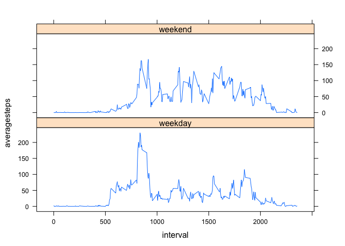

# Reproducible Research: Peer Assessment 1


## Loading and preprocessing the data


Set the working directory  

```r
setwd("~/Documents/Coursera/05. Reproducible Research/Peer Assessment 1/RepData_PeerAssessment1")
```

Unzip the activity.zip file.  

```r
unzip("./activity.zip")
```

The file activity.csv is saved in the same directory. Read the data

```r
data <- read.csv("activity.csv")
```

## What is mean total number of steps taken per day?


```r
hist(data$steps)
```

 

The plyr library is used to answer this question.  


```r
library(plyr)
stepsperday <- ddply(data, .(date), summarize, totalsteps = sum(steps))
```

The mean total number of steps taken every day

```r
meanWithoutImputing <- mean(stepsperday$totalsteps, na.rm = TRUE)
print(meanWithoutImputing)
```

```
## [1] 10766.19
```

The median of the total number of steps taken every day

```r
medianWithoutImputing <- median(stepsperday$totalsteps, na.rm = TRUE)
print(medianWithoutImputing)
```

```
## [1] 10765
```

## What is the average daily activity pattern?

Calculate the average steps for each interval (missing values are omitted)

```r
library(ggplot2)
stepsbyinterval <- ddply(data, .(interval), summarize, averagesteps = mean(steps, na.rm = TRUE))
plot(stepsbyinterval$interval, stepsbyinterval$averagesteps,type = "l")
```

 

Which 5-minute interval, on average across all the days in the dataset, contains the maximum number of steps?

```r
with(stepsbyinterval, interval[averagesteps == max(stepsbyinterval$averagesteps)])
```

```
## [1] 835
```

## Imputing missing values
total number of missing values in the dataset (i.e. the total number of rows with NAs)

```r
sum(is.na(data$steps))
```

```
## [1] 2304
```

```r
sum(is.na(data$date))
```

```
## [1] 0
```

```r
sum(is.na(data$interval))
```

```
## [1] 0
```

Filling strategy: Replace the NA values with the average steps for that interval

```r
imputeddata <- data
missingsteps <- is.na(imputeddata$steps)

for (i in 1:length(missingsteps)) {
        if (missingsteps[i]) {
                imputeddata$steps[i] <- 
                with(stepsbyinterval, 
                     averagesteps[interval == imputeddata$interval[i]])
        }
}
```

Validate that imputeddata does not longer contain NA values

```r
sum(is.na(imputeddata$steps))
```

```
## [1] 0
```

Histogram of the number of steps taken each day based on the imputed dataset

```r
hist(imputeddata$steps)
```

 

Mean and median total number of steps taken per day based on the imputed dataset


```r
stepsperdayimputed <- ddply(imputeddata, .(date), summarize, totalsteps = sum(steps))
```

The mean total number of steps taken every day

```r
meanWithImputing <- mean(stepsperdayimputed$totalsteps)
print(meanWithImputing)
```

```
## [1] 10766.19
```

The median of the total number of steps taken every day

```r
medianWithImputing <- median(stepsperdayimputed$totalsteps)
print(medianWithImputing)
```

```
## [1] 10766.19
```

####Do these values differ from the estimates from the first part of the assignment? 
Before imputing the mean was 1.0766189\times 10^{4}  
After imputing the mean was 1.0766189\times 10^{4}

Before imputing the median was 10765  
After imputing the median was 1.0766189\times 10^{4}

####What is the impact of imputing missing data on the estimates of the total daily number of steps?  
Imputing did not change the mean but the median increased and became equal to the mean  


## Are there differences in activity patterns between weekdays and weekends?
First add a new column with the weekday

```r
library(dplyr)
```

```
## 
## Attaching package: 'dplyr'
## 
## The following objects are masked from 'package:plyr':
## 
##     arrange, count, desc, failwith, id, mutate, rename, summarise,
##     summarize
## 
## The following object is masked from 'package:stats':
## 
##     filter
## 
## The following objects are masked from 'package:base':
## 
##     intersect, setdiff, setequal, union
```

```r
imputeddata <- mutate(imputeddata, DayType = weekdays(as.Date(date)))
```

Mark Monday, Tuesday, Wednesdday, Thursday, Friday as "weekday" and Saturday and Sunday as "weekend"

```r
imputeddata$DayType <- revalue(imputeddata$DayType, c("Monday" = "weekday", 
                               "Tuesday" = "weekday",
                               "Wednesday" = "weekday",
                               "Thursday" = "weekday",
                               "Friday" = "weekday",
                               "Saturday" = "weekend",
                               "Sunday" = "weekend"
                               ))
```

Calculate average number of steps for weekend and weekdays

```r
avgNumberOfStepsByDayType <- ddply(imputeddata, 
                                   .(DayType,interval), 
                                   summarize, 
                                   averagesteps = mean(steps, na.rm = TRUE))
```


```r
library(lattice)
xyplot(averagesteps~interval | DayType , 
       avgNumberOfStepsByDayType,
       type = "l",
       layout = c(1,2))
```

 
